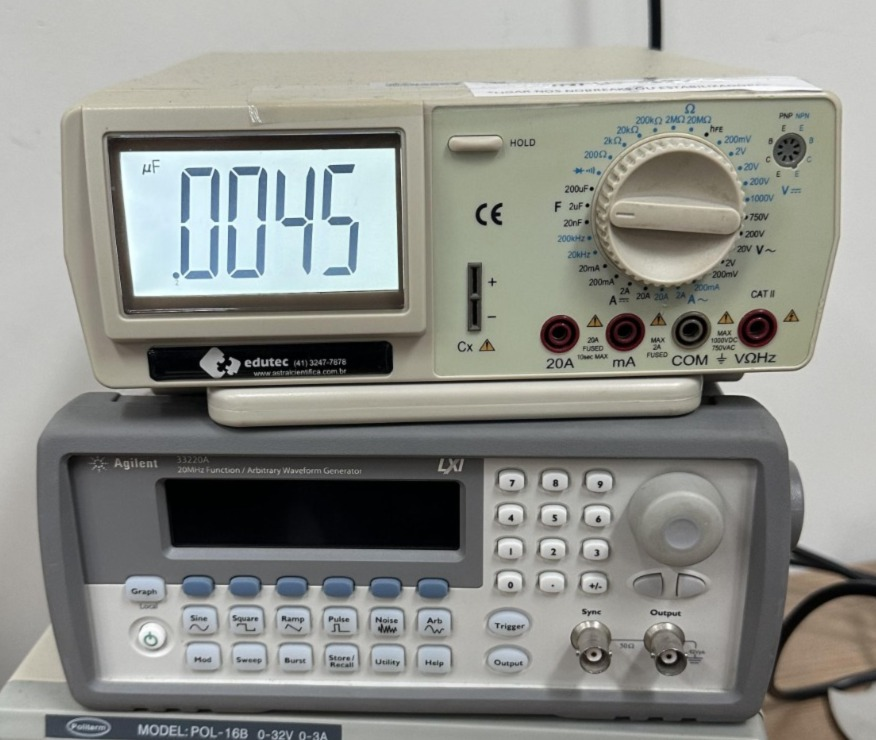
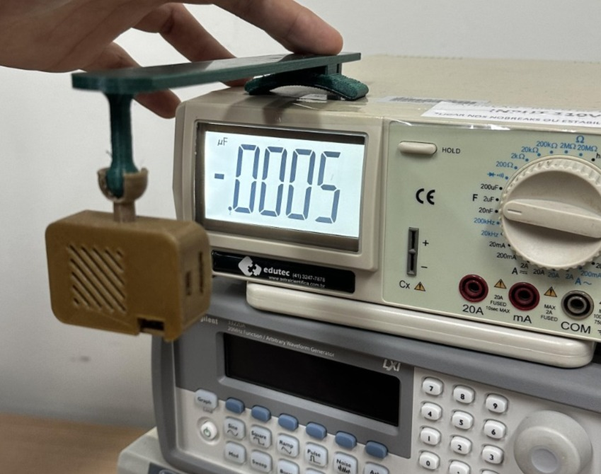
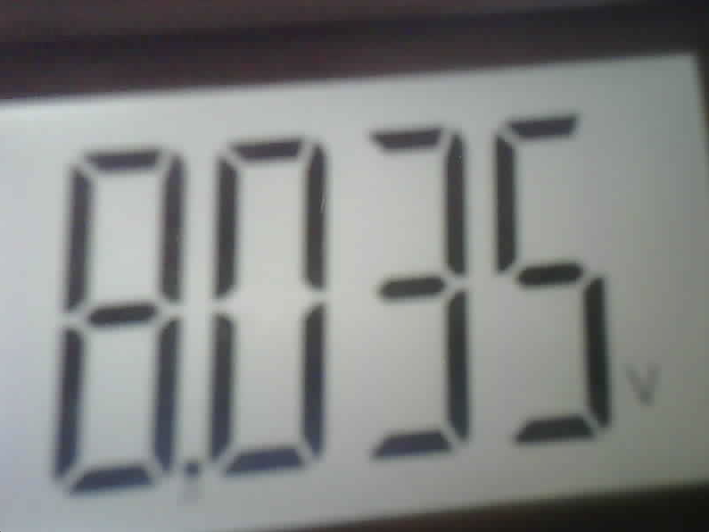
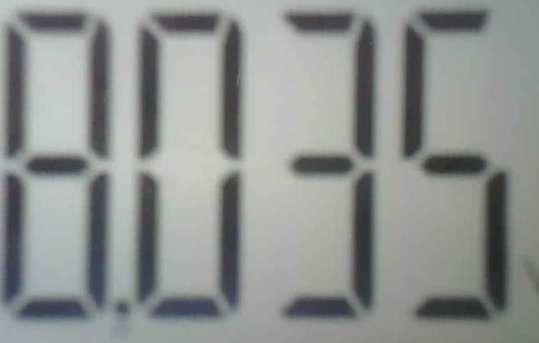
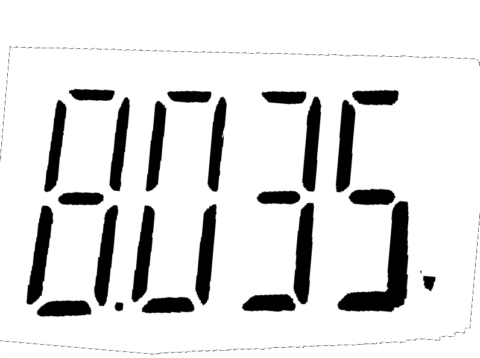
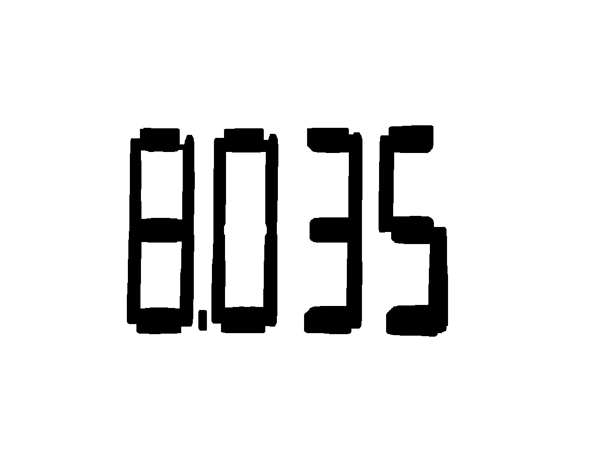
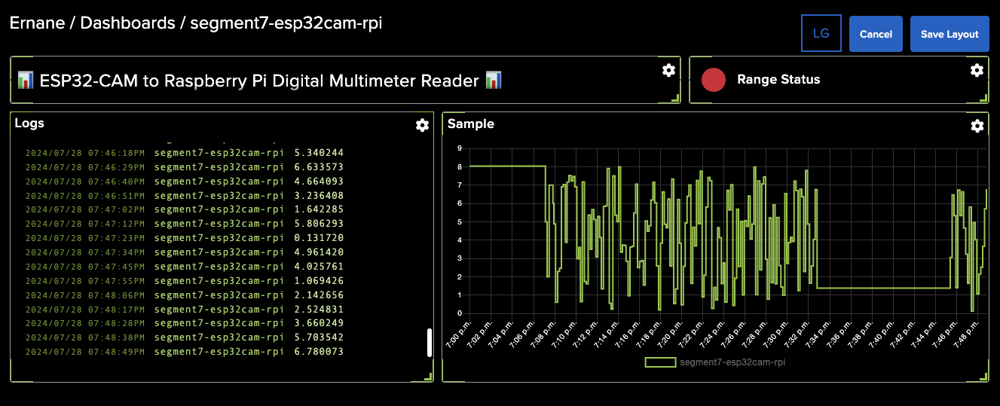
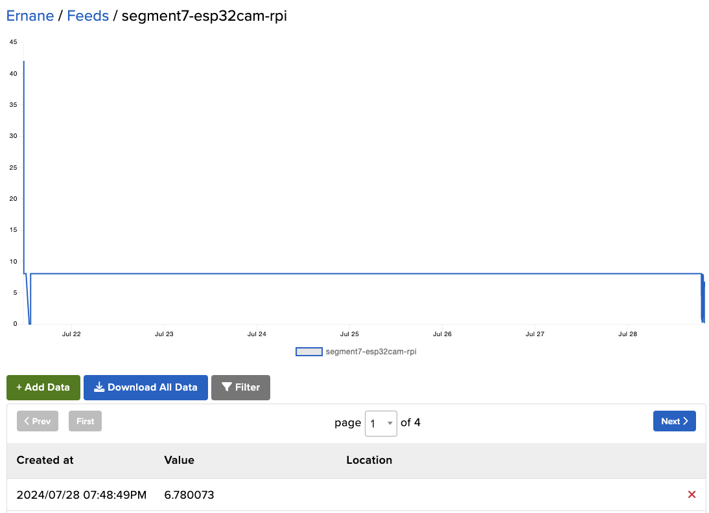

# IOT system for monitoring and notifying data from segment displays using image processing techniques 📸🔢🔍

This project integrates an ESP32-CAM with a Raspberry Pi to read and interpret digital displays from a multimeter, enhancing visibility and publishing data to a feed.

| Multimeter | Device |
|:-:|:-:|
|||

## Overview 📝

The ESP32-CAM captures images of a multimeter's 7-segment display, serving them over HTTP using its IP address. The Raspberry Pi then processes these images:

1. **Image Capture**: ESP32-CAM captures images of the multimeter's display.
2. **Image Processing**: Raspberry Pi receives images, enhances them for readability, and performs OCR using Tesseract to extract digits.
3. **Data Interpretation**: Recognized digits are processed, interpreted, and published to a feed at regular intervals.

## Execution 🚀

| Input | Perspective | Threshold |Corrected Orientation |
|:-:|:-:|:-:|:-:|
|||||

| Flood Fill | Corrected And Clean Orientation Image | Morphology |
|:-:|:-:|:-:|
||||

```bash
cd raspberrypi/build
cmake ..
make && ./main
[100%] Built target main
Starting image processing...
Image saved to: ../assets/input.jpg
Image loaded successfully.
Applying thresholding...
Correcting image orientation...
Applying morphological operations...
Morphological processing complete.
Performing OCR...
Tesseract initialized.
Image set for OCR.
OCR output: 8035
OCR complete.
Exiting...
```

## Feed and Dashboard

| Dashboard |
|:-:|
|[](https://io.adafruit.com/Ernane/dashboards/segment7-esp32cam-rpi)|

| Feed |
|:-:|
|[](https://io.adafruit.com/Ernane/feeds/segment7-esp32cam-rpi)|

## Report 📚

For a detailed explanation of the project, including methodologies and results, please refer to the [project report](doc/report.pdf).

## License 📄

This project is licensed under the MIT License. See the [LICENSE](LICENSE) file for details.
