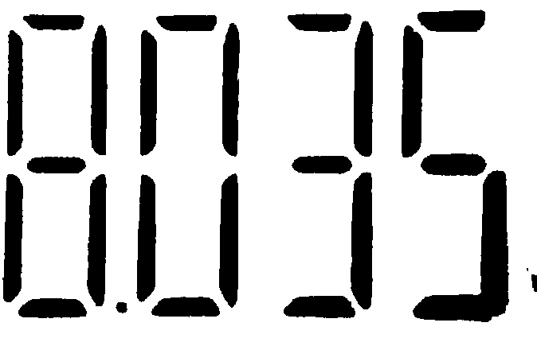
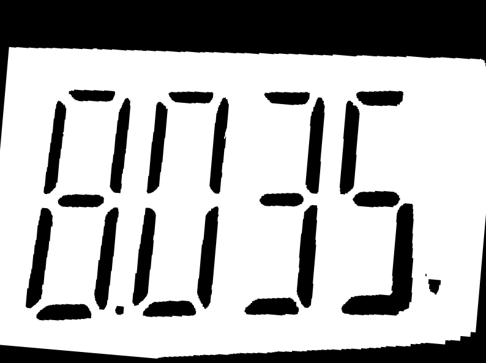
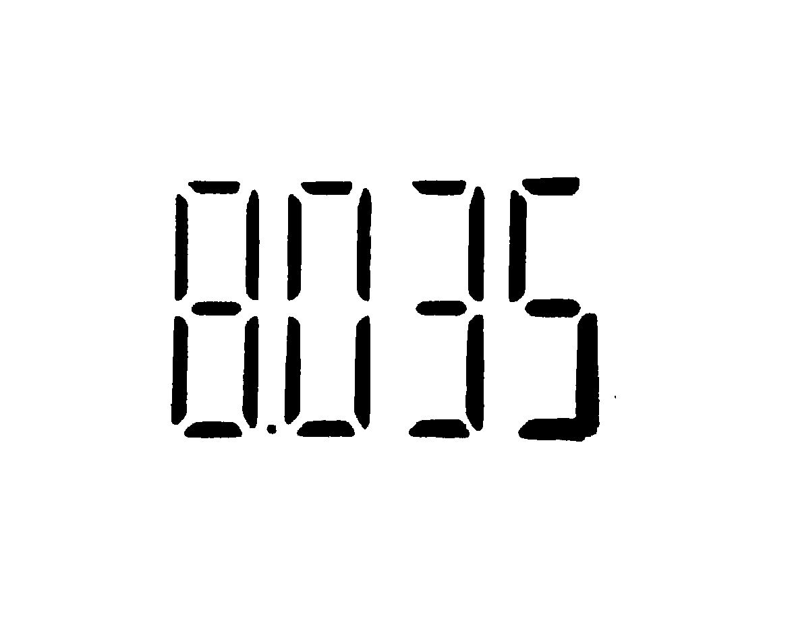

# ESP32-CAM to Raspberry Pi Digital Multimeter Reader 📸🔢🔍

This project integrates an ESP32-CAM with a Raspberry Pi to read and interpret digital displays from a multimeter, enhancing visibility and publishing data to a feed.

| Multimeter | Device |
|:-:|:-:|
|||

## Overview 📝

The ESP32-CAM captures images of a multimeter's 7-segment display, serving them over HTTP using its IP address. The Raspberry Pi then processes these images:

1. **Image Capture**: ESP32-CAM captures images of the multimeter's display.
2. **Image Processing**: Raspberry Pi receives images, enhances them for readability, and performs OCR using Tesseract to extract digits.
3. **Data Interpretation**: Recognized digits are processed, interpreted, and published to a feed at regular intervals.

## Execution 🚀

| Input | Threshold | Corrected Orientation |
|:-:|:-:|:-:|
||||

| Flood Fill | Corrected And Clean Orientation Image | Morphology |
|:-:|:-:|:-:|
||||

```bash
cd raspberrypi/build
cmake ..
make && ./main
[100%] Built target main
Starting image processing...
Image saved to: ../assets/input.jpg
Image loaded successfully.
Applying thresholding...
Correcting image orientation...
Applying morphological operations...
Morphological processing complete.
Performing OCR...
Tesseract initialized.
Image set for OCR.
OCR output: 8035
OCR complete.
Exiting...
```

## Feed and Dashboard

| Dashboard |
|:-:|
|[](https://io.adafruit.com/Ernane/dashboards/segment7-esp32cam-rpi)|

| Feed |
|:-:|
|[](https://io.adafruit.com/Ernane/feeds/segment7-esp32cam-rpi)|

## Hardware Setup 🔧

- **ESP32-CAM**: Captures images of the multimeter's display.
- **Raspberry Pi**: Receives images from ESP32-CAM, processes them, and publishes data.
- **Multimeter with 7-segment Display**: Source of digital readings.
- **Internet Connection**: Required for ESP32-CAM to serve images and Raspberry Pi for data processing.

## Software Requirements 🖥️

- **ESP32 Arduino Library**: Required for ESP32-CAM image capture.
- **OpenCV**: Image processing library on Raspberry Pi.
- **Tesseract**: OCR engine for digit recognition.

## Installation and Setup 🛠️

### ESP32-CAM Setup

1. Flash the ESP32-CAM with the provided Arduino sketch.
2. Update WiFi credentials (`WIFI_SSID` and `WIFI_PASS`) in the code.
3. Ensure ESP32-CAM is powered and connected to the network.

### Raspberry Pi Setup

1. Install OpenCV and Tesseract on Raspberry Pi.
2. Clone and compile the provided Raspberry Pi image processing script.
3. Configure the script to subscribe to ESP32-CAM's image stream and publish results to the http feed.

### Running the System

1. Power on ESP32-CAM and Raspberry Pi.
2. ESP32-CAM serves images over HTTP.
3. Raspberry Pi captures, enhances, performs OCR on images, and publishes data to the http feed.

## Example Usage 🧪

1. Access ESP32-CAM's image feed via `http://<ESP32-CAM_IP>/cam.jpg`.
2. Raspberry Pi processes images and publishes interpreted data.
3. Monitor MQTT topics for real-time readings.

## Troubleshooting 🛠️

- Ensure ESP32-CAM and Raspberry Pi are connected to the same network.
- Verify correct configuration of WiFi credentials and http feed settings.
- Check system logs and debug messages for errors.

## Report 📚

For a detailed explanation of the project, including methodologies and results, please refer to the [project report](doc/report.pdf).

## License 📄

This project is licensed under the MIT License. See the [LICENSE](LICENSE) file for details.
